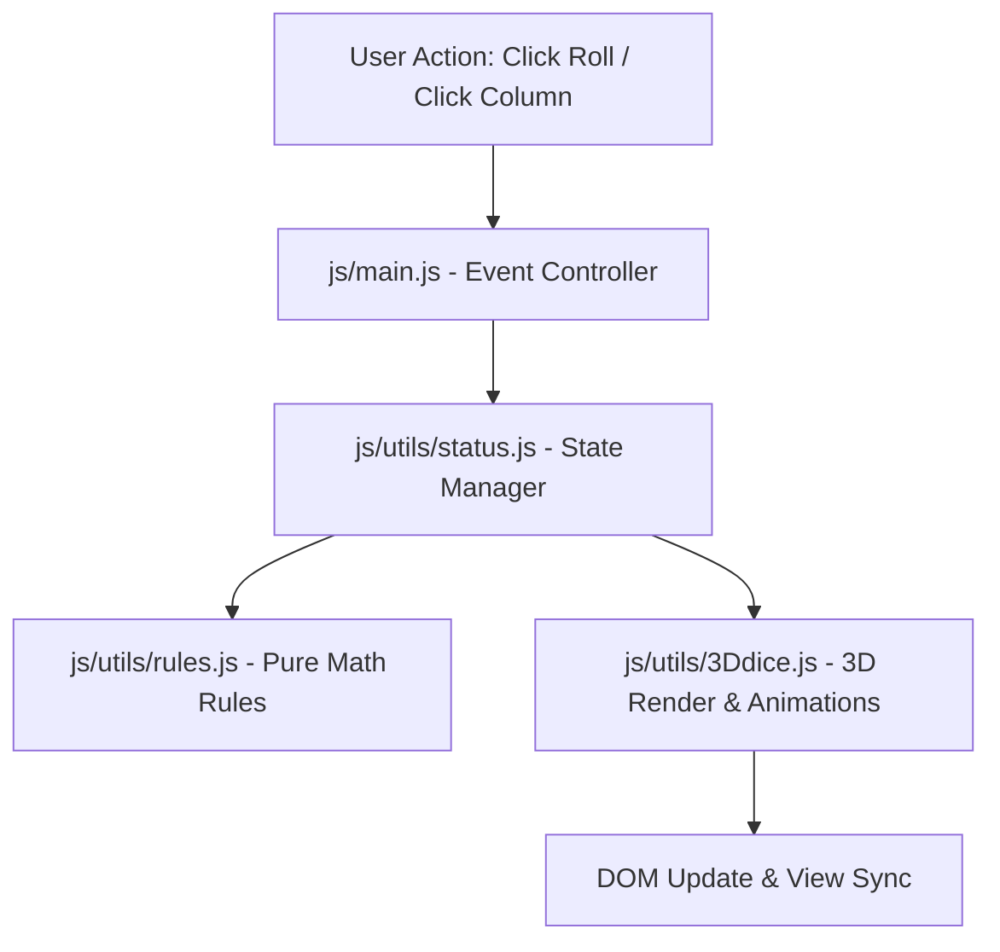

# Technical Architecture & Codebase Design

This document details the software architecture, folder organization, state management flow, and 3D CSS rendering engine of Matatena.

---

## 🗂️ File & Directory Map

```text
matatena/
├── README.md                 # Project introduction and quick start
├── docs/                     # Project documentation folder
│   ├── RULES.md              # Detailed rules and scoring formulas
│   ├── ARCHITECTURE.md       # System design and technical architecture
│   └── DEVELOPMENT.md        # Developer setup and customization guide
├── general.css               # Global CSS variables, fonts, and reset styles
│
├── components/               # Reusable UI component stylesheets
│   ├── dice.css              # 3D CSS cube, pips, and board dice styles
│   └── my-button.css         # Animated pill-style button component
│
├── pages/                    # Page-specific views & styles
│   ├── index/                # Home / Landing page
│   │   ├── index.html
│   │   └── index.css
│   └── game/                 # Main gameplay page
│       ├── game.html
│       └── game.css
│
└── js/                       # Core JavaScript logic & state engine
    ├── classes/              # Data models
    │   ├── dice.js           # Dice class model
    │   └── player.js         # Player class model
    ├── utils/                # Helper utilities & state manager
    │   ├── 3Ddice.js         # 3D CSS cube rendering & animation engine
    │   ├── rules.js          # Pure function rule calculation engine
    │   └── status.js         # Global game state manager
    └── main.js               # Main UI event listener and DOM controller
```

---

## ⚙️ Core System Architecture

The game follows a clean separation between **Data Models**, **Rule Functions**, **State Management**, and **UI View Controllers**.



### 1. Data Models (`js/classes/`)
- **`Dice.js`**: Represents a single 6-sided die object with a `.throw()` method generating values between 1 and 6.
- **`Player.js`**: Holds the player's name and an array of 3 column arrays storing numerical dice values (`[[...], [...], [...]]`).

### 2. Rule Calculation Engine (`js/utils/rules.js`)
Contains pure, side-effect-free helper functions:
- `calculateColumnScore(columnValues)`: Calculates column score including pairs ($2\times$) and triplets ($3\times$).
- `columnScoreSeparated(columns)`: Computes score array for all 3 columns.
- `calculatePlayerScore(columns)`: Sums column scores for total player score.
- `removeMatchingDice(oponentColumn, placedValue)`: Returns new array with matching values filtered out.
- `isBoardFull(columns)`: Checks if all 3 columns reached 3 dice.

### 3. State Manager (`js/utils/status.js`)
Manages global session state (`players`, `currentPlayerIndex`, `currentDice`, `isGameOver`):
- Enforces turn rules (preventing players from placing dice out of turn).
- Coordinates dice rolls and dice placements.
- Evaluates game-over state and computes winner data.

### 4. DOM Controller (`js/main.js`)
Acts as the bridge between user inputs and game state:
- Binds event listeners to roll buttons and column buttons.
- Synchronizes DOM elements (`.dice-area`, `.score-val`, `#winner-text`) after state changes.
- Triggers targeted CSS animations (`popIn` on placement, `shrinkOut` on destruction).

---

## 🎲 Pure CSS 3D Dice Engine (`js/utils/3Ddice.js` & `components/dice.css`)

Instead of loading heavy 3D WebGL libraries like Three.js, the 3D dice tumbling effect is built with pure CSS 3D transforms:

1. **Perspective Container:** `.cube-container` establishes a 3D viewing perspective (`perspective: 400px`).
2. **3D Cube Object:** `.cube` preserves 3D spatial transforms (`transform-style: preserve-3d`).
3. **6 Face Geometry:** Each of the 6 `.cube-face` elements is translated $32\text{px}$ along the Z-axis after rotation:
   - Front: `translateZ(32px)`
   - Back: `rotateY(180deg) translateZ(32px)`
   - Right: `rotateY(90deg) translateZ(32px)`
   - Left: `rotateY(-90deg) translateZ(32px)`
   - Top: `rotateX(90deg) translateZ(32px)`
   - Bottom: `rotateX(-90deg) translateZ(32px)`
4. **Tumbling Roll Animation:** `Dice3D.rollToValue` applies a calculated rotation (`rotateX` and `rotateY`) with extra $360^\circ$ spin rotations using a custom CSS `cubic-bezier(0.2, 0.8, 0.3, 1)` transition curve.

---

## 🔗 Related Documentation

- 🏠 [README.md](../README.md) — Main project overview and setup instructions.
- 📜 [RULES.md](RULES.md) — Complete game rules and scoring formulas.
- 🛠️ [DEVELOPMENT.md](DEVELOPMENT.md) — Developer setup and customization guide.
